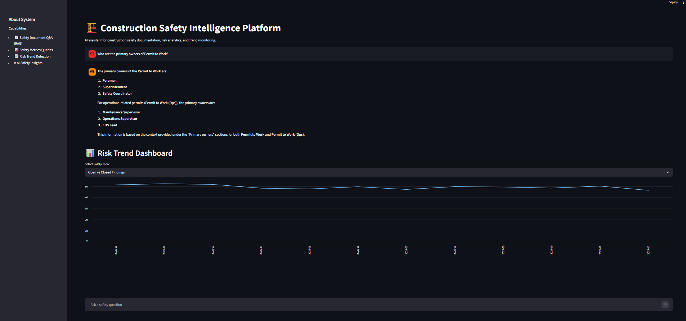
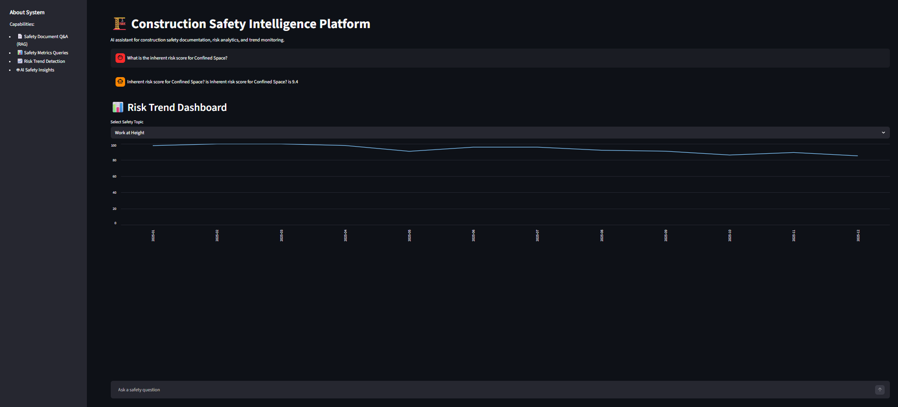
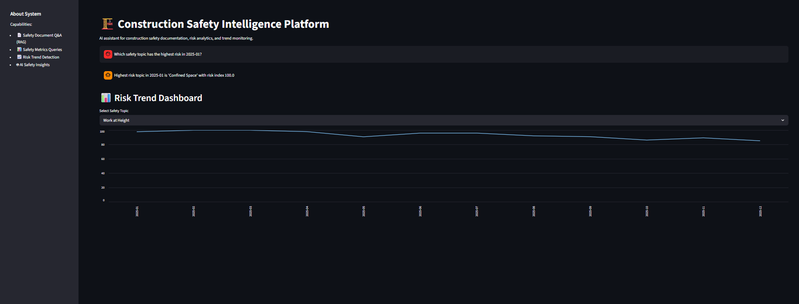
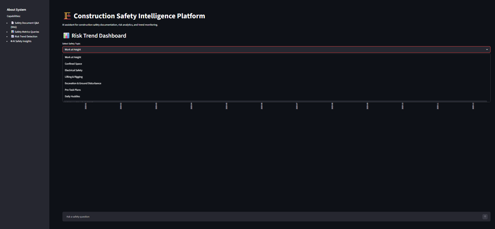

# Construction Safety AI Assistant

Run the Streamlit application locally:
Steps of to run:

> Pull repository 

> Start the Streamlit server:

> streamlit run app.py

Once the server starts, open the network URL shown in the terminal. Example:

Network URL = http://192.168.1.25:8501

Note: The application will only be accessible while the Streamlit server is running.


Make sure you are connected to the same network to access the application.

## Overview

Construction projects generate large volumes of safety information across the project lifecycle—from early planning documents to on-site inspection logs, corrective actions, trend dashboards, and post-handover maintenance records. In practice, this information is split across unstructured documents and structured numeric tables. Finding the right answer quickly depends on understanding both the lifecycle hierarchy and which data source contains the answer.

This project presents an **Construction_Safety_Chatbot** that allows users to ask natural language questions about safety processes, risk metrics, and project trends. The system intelligently routes queries to the appropriate data source and combines **document retrieval (RAG)** with **structured analytics** to provide grounded and accurate responses.

The assistant supports:

* Knowledge-based questions from safety documentation
* Numeric and metrics-based queries from structured datasets
* Hybrid queries combining documentation and metrics
* Safety analytics and trend insights

The goal is to help construction teams **access safety knowledge faster, monitor risk trends, and support better decision-making**.

---

## Key Features

**1. Intelligent Query Routing**

User queries are automatically classified into four categories:

* **TXT** – Questions answered using safety documentation (RAG)
* **CSV** – Questions answered using structured safety metrics
* **ANALYTICS** – Risk and trend analysis across time
* **HYBRID** – Queries that combine documentation and structured data

---

**2. Retrieval-Augmented Generation (RAG)**

Safety documentation is indexed using a vector database.
When a user asks a knowledge-based question, the system retrieves relevant document chunks and uses an LLM to generate an answer grounded in those sources.

---

**3. Structured Data Analytics**

The assistant can compute values from CSV datasets including:

* inherent risk scores
* inspections completed
* risk indices
* compliance metrics
* safety performance indicators

This allows the system to answer quantitative questions reliably.

---

**4. Risk & Trend Analysis**

The system can also perform higher-level analytics such as:

* identifying the **highest risk safety topic for a given month**
* detecting **topics with increasing risk**
* identifying **topics showing improvement**
* highlighting **areas that require management attention**

---

**5. Interactive Dashboard**

A simple **Streamlit interface** allows users to interact with the assistant in real time.
Users can ask questions and instantly receive responses from the appropriate data source.

---

## System Architecture

User Question
↓
Intent Detection
↓

| Query Type | Processing Method                            |
| ---------- | -------------------------------------------- |
| TXT        | RAG over safety documentation                |
| CSV        | Direct computation from metrics datasets     |
| ANALYTICS  | Risk and trend analysis                      |
| HYBRID     | Combines RAG results with structured metrics |

---

## Project Structure

```
construction-safety-ai
│
├── app.py
├── README.md
├── requirements.txt
│
├── data
│   ├── construction_monthly_metrics_numeric.csv
│   ├── baseline_metrics.csv
│   └── safety_documents
│
└── src
    ├── main.py
    ├── rag
    ├── router
    ├── csv_tools
    ├── analytics
    └── hybrid
```

---

## Installation

Clone the repository:


Install dependencies:

```
pip install -r requirements.txt
```

Make sure your environment variables for Azure OpenAI are configured.

---

## Running the Application

### Terminal Interface

Run the assistant in terminal mode:

```
python src/main.py
```

You can then ask questions directly in the command line.

---

### Streamlit Dashboard

To run the web interface:

```
streamlit run app.py
```

This launches a browser-based interface where users can interact with the assistant.

---

## Example Questions

### Knowledge Questions (Documentation)

* Who are the primary owners of Permit to Work?
* What does Scaffold & Fall Protection Audits focus on?
* List the typical data fields captured for Work at Height.

---

### Metrics Questions (CSV Data)

* What is the inherent risk score for Confined Space?
* Across all topics in 2025-08, what is the total inspections completed?
* In which months did TRIR tracking have a non-zero value?

---

### Hybrid Questions

* For Confined Space, list the typical fields and provide baseline permit_required_pct and training hours.
* For Weekly Safety Inspections, list related items and report findings opened and closed in 2025-02.

---

### Analytics Questions

* Which safety topic has the highest risk in 2025-01?
* Which topics are showing increasing risk trends?
* Which safety topics are improving over time?

---
### Embedding Model

The Azure environment provided for the hackathon only includes the GPT-4o deployment, which supports chat completion but does not support embedding generation. Attempting to generate embeddings with GPT-4o results in the following error:

OperationNotSupported: embeddings operation does not work with model gpt-4o

To address this limitation, the project uses local embeddings via the SentenceTransformers library instead of Azure embeddings.

Embedding Model Used: all-MiniLM-L6-v2

This model is lightweight, fast, and works effectively for semantic search in the RAG pipeline.

Architecture:

Embeddings: Local (SentenceTransformers – all-MiniLM-L6-v2)

Vector Store: FAISS

LLM: GPT-4o (Azure OpenAI)
## Technologies Used

* Python
* Streamlit
* Pandas
* FAISS (vector search)
* Azure OpenAI
* Retrieval-Augmented Generation (RAG)

---

## Future Improvements

Possible extensions include:

* multi-turn conversation memory
* downloadable reports
* automated evaluation benchmarks
* expanded analytics dashboards
* integration with real project safety systems

---

## Purpose of This Project

This system was built as part of a **Construction AI/ML Hackathon challenge** focused on applying artificial intelligence to real-world safety management problems.

The project demonstrates how combining **document intelligence, structured analytics, and LLM reasoning** can create practical tools for improving safety awareness and decision support in construction environments.

---

## Application Screenshots

### Document Question Answering (RAG)



---

### CSV Metrics Query



---

### Risk Analytics Query



---

### Streamlit Dashboard


